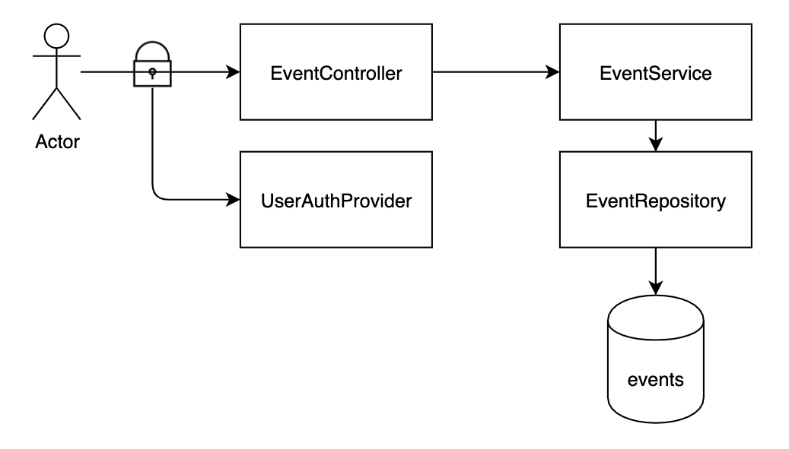

#### Minimal Micronaut application

Micronaut sample app for storing task events and retrieving statistics based on them. 

#### frameworks/libraries in use:
- *Micronaut core/http/security/validation* - tools necessary to build application  
- *ProjectReactor* - for async/reactive communication
- *Junit5/Assertj* - for testing logic    

#### endpoints:
Endpoints are secured by `Basic` auth.

| Endpoint             | Method | URL                        | Role       |
|----------------------|--------|----------------------------|------------|
| Save user event      | `POST` | `/api/v1/event`            | User/Admin |
| Get user event       | `GET`  | `/api/v1/event`            | User/Admin |
| Get event statistics | `GET`  | `/api/v1/event/statistics` | Admin      |

